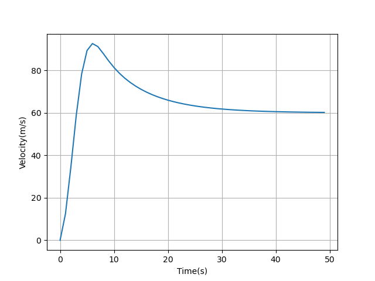

# Cruise-controller
Implementation of linear control algorithm on dynamical model of the cruise control system of a car using PID Controller
# Dynamics
Neglecting the inertia of the wheels,
and assuming that air drag (which is proportional to the car’s speed at low speeds) is what is
opposing the motion of the car, then the motion model is reduced to a simple first order system. 
Thus the motion of the car can be written as:
> mv' + bv = u

where u is the input force provided by the engine to move the car at a certain velocity.
# Model Parameters
```
Mass (m) = 1200 kg
Drag coefficient (b) = 50
Desired velocity = 60 m/s
```
# Results

Following graphs were obtained by choosing appropriate tuning parameters that give the system
a rise time (time it takes to reach 90% of the steady state value) of about 10secs and 
maximum overshoot of less than 5%. 


1.**Graph showing the set point change and the response of the system to the
change.**


 
 
 
2.**Graph showing response of the altered dynamical model of the car to handle
desired velocity changes from 60 to 40 and to handle rolling friction as well, 
assuming the coefficient of friction to be 0.01.**


 
 
 
3.**Graph showing response of the model on a constant slope of road. The slope can be both positve
 or negative**
 
 
 
